# GitHub Terminal Profile Generator

This project builds a polished, animated terminal-style SVG from a profile image. It converts the photo into a grayscale ASCII portrait, renders it into a neon terminal dashboard, and exports a single SVG ready to embed in a GitHub README.



## Features

- Grayscale portrait conversion and contrast enhancement
- Facial-edge-aware ASCII generation
- Centered, optimized ASCII layout
- Premium terminal chrome with neon cyan accents
- Typing, blink, glow, scanline, and CRT-style effects
- Single-file SVG export for README embedding

## Requirements

- Python 3.12+
- Pillow
- NumPy
- svgwrite

Install dependencies:

```bash
pip install -r requirements.txt
```

## Usage

Run the export pipeline:

```bash
python scripts/export_svg.py
```

This will generate:

- assets/ascii.txt
- assets/portrait.svg
- assets/terminal.svg

## Configuration

Edit config.py to change the developer profile metadata, image path, width, animation speed, and theme.

## GitHub Actions

The workflow in .github/workflows/build_terminal.yml regenerates the assets on every push and commits the output files back to the repository.
